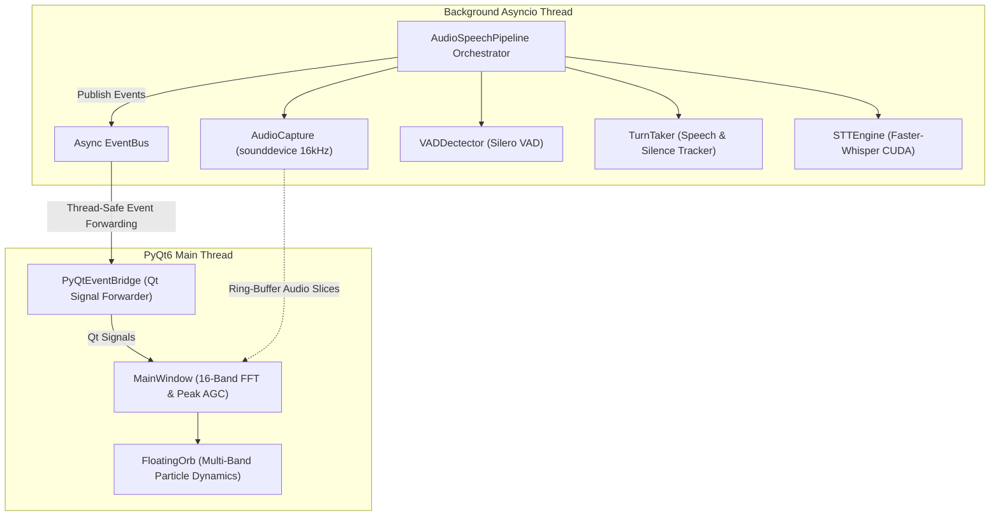

# S.Y.N.C. (Synthetic Neural Companion)

<div align="center">

```
   ███████╗   ██╗   ██╗   ███╗   ██╗    ██████╗ 
  ██╔════╝   ╚██╗ ██╔╝   ████╗  ██║   ██╔════╝ 
  ███████╗    ╚████╔╝    ██╔██╗ ██║   ██║      
  ╚════██║     ╚██╔╝     ██║╚██╗██║   ██║      
  ███████║      ██║      ██║ ╚████║   ╚██████╗ 
  ╚══════╝      ╚═╝      ╚═╝  ╚═══╝    ╚═════╝ 
```

**An autonomous, offline acoustic neural entity living within your desktop workspace.**

[](#)
[](#)
[](#)
[](#)
[](#)
[](#)

*Resonating on your frequency.*

</div>

---

## 🌟 Overview

**S.Y.N.C.** is a fully local, privacy-first voice assistant designed to operate with zero cloud dependencies. It combines a real-time asynchronous acoustic perception pipeline with a custom 3D holographic floating orb visualizer that reacts dynamically to voice frequencies.

---

## ⚡ Key Features

* 🎙️ **Real-Time Acoustic Ingestion:** Non-blocking 16kHz audio streaming with ring buffer audio history ([`audio/capture.py`](audio/capture.py)).
* 🧠 **Neural Voice Activity Detection:** Low-latency Silero VAD (512-sample frame slicing) with confidence scoring ([`audio/vad.py`](audio/vad.py)).
* ⏱️ **Turn-Taking State Machine:** Automatic speech onset detection and silence threshold verification ([`audio/turn_taking.py`](audio/turn_taking.py)).
* ⚡ **CUDA-Accelerated STT:** High-precision speech-to-text with Faster-Whisper (`distil-large-v3.5` / `base` / `small`) ([`speech/stt.py`](speech/stt.py)).
* 🔮 **Holographic Floating Orb:** Hardware-accelerated PyQt6 desktop orb with 16-band logarithmic FFT frequency decomposition and 3-ring wavy particle animations ([`ui/widgets.py`](ui/widgets.py)).
* 🛡️ **Thread-Safe Architecture:** Tri-thread concurrency model bridging PortAudio C streams, Python `asyncio`, and the PyQt6 GUI ([`ui/bridge.py`](ui/bridge.py)).

---

## 🏗️ Architecture



---

## 📁 Technical Documentation

Deep mathematical specifications, algorithm definitions, and geometry models are documented under [`docs/`](docs/):

* [**`01. Audio Pipeline & Timing Math`**](docs/01_audio_pipeline_and_timing.md) — Sample rates, chunk duration, buffer capacity formulas.
* [**`02. VAD & Turn-Taking Geometry`**](docs/02_vad_and_turn_taking.md) — 512-sample frame slicing & turn-taking state transitions.
* [**`03. Spectral Analysis, FFT & AGC`**](docs/03_spectral_analysis_and_fft.md) — Hanning window, RFFT, 16 geometric log bands, Peak AGC equations.
* [**`04. Floating Orb Physics & Rendering`**](docs/04_orb_geometry_and_physics.md) — Parametric polar equations, 3-ring frequency coupling & easing.
* [**`05. STT Inference Engine`**](docs/05_stt_inference_engine.md) — CTranslate2 execution graph, quantization, and model performance.
* [**`06. Concurrency & Lifecycle`**](docs/06_concurrency_and_lifecycle.md) — Tri-thread topology, Windows DLL safety & shutdown sequence.

---

## 🚀 Getting Started

### Prerequisites
* **OS:** Windows 10/11 (x64)
* **Python:** 3.10+
* **GPU (Recommended):** NVIDIA GPU with CUDA support

### Installation

```bash
# 1. Clone the repository
git clone https://github.com/your-username/S.Y.N.C.git
cd S.Y.N.C

# 2. Create and activate a virtual environment
python -m venv venv
venv\Scripts\activate

# 3. Install PyTorch with CUDA (recommended for GPU acceleration)
pip install torch torchaudio --index-url https://download.pytorch.org/whl/cu121

# 4. Install all application dependencies
pip install -r requirements.txt
```

### Running S.Y.N.C.

```bash
python main.py
```

---

## ⚙️ Configuration

Application settings are managed in [`config/default.yaml`](config/default.yaml):

```yaml
app:
  name: "S.Y.N.C."
  version: "0.1.0-alpha"

speech:
  sample_rate: 16000
  chunk_size: 1024
  buffer_seconds: 5
  silence_threshold: 1.5
```

---

## 🗺️ Roadmap & Milestones

See [`ROADMAP.md`](ROADMAP.md) for milestone progress and upcoming releases.

---

## 📜 License

Distributed under the MIT License. See `LICENSE` for details.