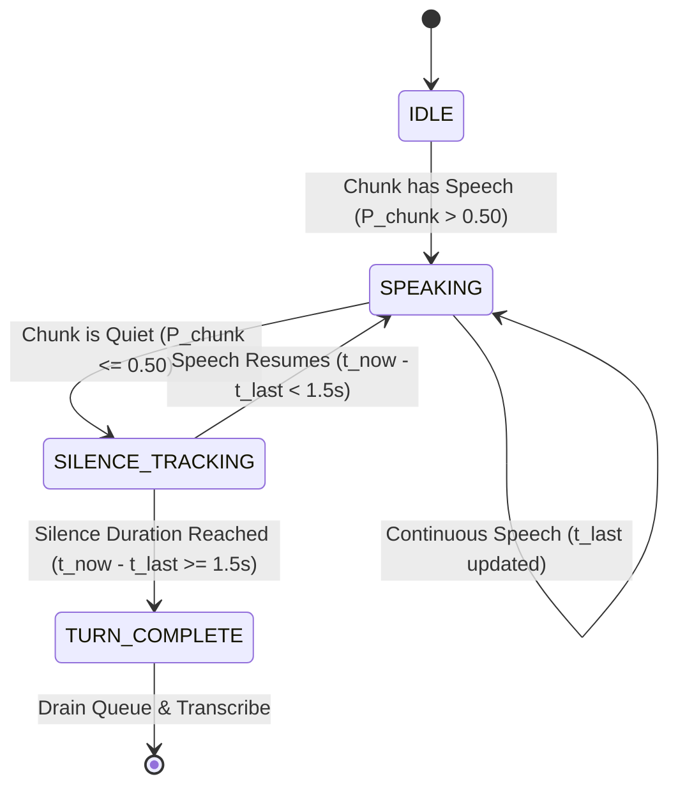

# Module 02: Voice Activity Detection (VAD) & Turn-Taking Geometry

## 1. Silero VAD Tensor Constraints

The VAD subsystem ([`audio/vad.py`](../audio/vad.py)) wraps the neural Silero VAD model. Silero enforces strict geometric tensor input constraints:

* At $f_s = 16,000\text{ Hz}$, the input tensor must have an exact length of **$512\text{ samples}$** ($\Delta t_{\text{frame}} = 32.0\text{ ms}$).
* At $f_s = 8,000\text{ Hz}$, the input tensor must have an exact length of **$256\text{ samples}$** ($\Delta t_{\text{frame}} = 32.0\text{ ms}$).

Because the audio capture buffer provides chunks of $N = 1024\text{ samples}$ ($\Delta t = 64\text{ ms}$), an input chunk cannot be evaluated directly as a single tensor.

---

## 2. Sliding Window Frame Slicing & Aggregation

To process arbitrary chunk sizes $L \ge 512$, [`VADDectector.detect()`](../audio/vad.py) partitions the 1D audio array into non-overlapping frames of size $W = 512$:

```
Chunk Array (1024 samples):
[ 0 ────────────────────── 511 | 512 ──────────────────── 1023 ]
             │                                   │
             ▼                                   ▼
      Frame 0 (512 samples)               Frame 1 (512 samples)
             │                                   │
             ▼                                   ▼
     Silero VAD Model                    Silero VAD Model
             │                                   │
             ▼                                   ▼
       p_0 in [0, 1]                       p_1 in [0, 1]
             │                                   │
             └─────────────────┬─────────────────┘
                               ▼
            P_chunk = max(p_0, p_1)
            Is_Speech = P_chunk > 0.50
```

### Mathematical Formulation

Given an audio array $x \in \mathbb{R}^L$:

$$\text{Frame Count } M = \left\lfloor \frac{L - W}{W} \right\rfloor + 1 = \left\lfloor \frac{1024 - 512}{512} \right\rfloor + 1 = 2\text{ frames}$$
$$\text{Frame } k: \quad \mathbf{f}_k = x[k \cdot W : (k+1) \cdot W], \quad k \in \{0, 1, \dots, M-1\}$$
$$\text{Frame Probability } p_k = \mathcal{M}_{\text{silero}}\left(\mathbf{f}_k, \, f_s\right) \in [0.0, \, 1.0]$$
$$\text{Chunk Peak Confidence } P_{\text{chunk}} = \max_{k \in [0, M-1]} p_k$$
$$\text{Speech Classification } \mathcal{C}(x) = \begin{cases} \text{True}, & \text{if } P_{\text{chunk}} > 0.50 \\ \text{False}, & \text{otherwise} \end{cases}$$

---

## 3. Turn-Taking State Machine & Silence Verification

Conversation turn dynamics are managed by [`TurnTaker`](../audio/turn_taking.py).



### State Equations

Let $t_{\text{now}}$ be the current system timestamp and $t_{\text{last\_speech}}$ be the timestamp of the most recent chunk satisfying $\mathcal{C}(x) = \text{True}$.

1. **Speech Condition:**
   $$\text{If } \mathcal{C}(x_{\text{chunk}}) = \text{True} \implies t_{\text{last\_speech}} \leftarrow t_{\text{now}}, \quad S_{\text{speaking}} \leftarrow \text{True}$$

2. **Silence Evaluation:**
   $$\Delta t_{\text{silence}} = t_{\text{now}} - t_{\text{last\_speech}}$$

3. **Turn Completion Condition ([`is_done_speaking()`](../audio/turn_taking.py)):**
   $$\text{IsDoneSpeaking} = \begin{cases} \text{True}, & \text{if } t_{\text{last\_speech}} \ne \text{None} \;\land\; \Delta t_{\text{silence}} > T_{\text{threshold}} \\ \text{False}, & \text{otherwise} \end{cases}$$
   $$\text{Default } T_{\text{threshold}} = 1.5\text{ seconds}$$
