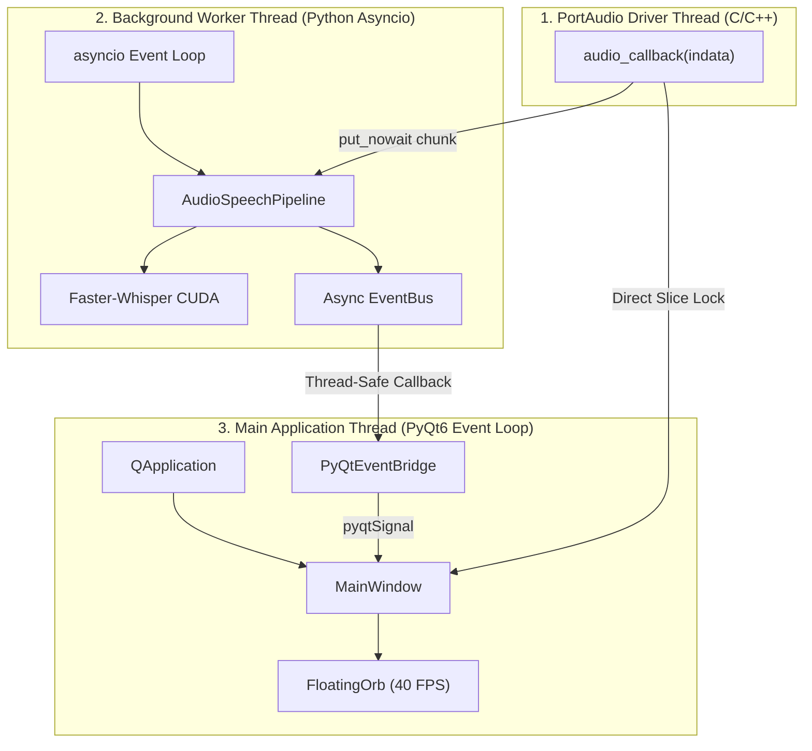

# Module 06: Concurrency Architecture, Inter-Thread IPC & Lifecycle

## 1. Tri-Thread Concurrency Topology

The application coordinates three concurrent execution contexts to guarantee that continuous real-time audio capture, heavy neural inference, and UI rendering never block each other:



---

## 2. Inter-Thread Communication (IPC) Channels

### Channel A: Audio Sample Slices (Driver $\rightarrow$ UI)
* **Mechanism:** `AudioCapture.buffer` (`collections.deque`) protected by `threading.Lock()`.
* **Access Frequency:** $40\text{ Hz}$ ($25\text{ ms}$ interval from `MainWindow.visualizer_timer`).
* **Latency:** $< 0.1\text{ ms}$ mutex acquisition time.

### Channel B: Raw Audio Chunks (Driver $\rightarrow$ Async Orchestrator)
* **Mechanism:** `queue.Queue[np.ndarray]` (`_audio_queue`).
* **Producer:** `_on_audio_callback()` via PortAudio stream.
* **Consumer:** `AudioSpeechPipeline.get_user_utterance()`.
* **Safety:** Atomic, unbounded FIFO buffer; drained automatically before each new turn.

### Channel C: State Notifications (Async $\rightarrow$ UI Bridge)
* **Mechanism:** [`PyQtEventBridge`](../ui/bridge.py) bridging [`EventBus`](../core/event_bus.py) to Qt Signals.
* **Signal Signature:** `event_received = pyqtSignal(str, dict)`.
* **Thread Marshalling:** Qt automatically posts signals across thread boundaries via Qt's internal thread-safe message queue.

---

## 3. Platform Constraint: Windows DLL Collision Mitigation

### Root Cause
On Windows systems, loading `torch` C++ dynamic link libraries (`c10.dll`, `torch_cuda.dll`) **after** `PyQt6` initializes Qt C++ core DLLs (`QtCore.dll`, `QtGui.dll`) triggers Windows DLL memory space collision errors (access violation / corrupt symbol tables).

### Solution Pattern
Enforce pre-import order at the absolute first line of [`main.py`](../main.py):

```python
# MUST be imported first before any PyQt6 or external C-extensions:
import torch  # Pre-loads CUDA & C10 DLLs cleanly into process memory space
import asyncio
from PyQt6.QtCore import QObject
from PyQt6.QtWidgets import QApplication
```

---

## 4. Graceful Shutdown & Cleanup Protocol

When the user closes the main desktop window:

```
[ User Closes MainWindow ]
           │
           ▼
 MainWindow.closeEvent() ──> Closes FloatingOrb widget & accepts event
           │
           ▼
 QApplication.exec() exits
           │
           ▼
 PyQtEventBridge._unsubscribe_all() ──> Detaches all EventBus listeners
           │
           ▼
 bg_loop.call_soon_threadsafe(cancel_all_tasks)
           │
           ▼
 AudioCapture.stop() ──> Closes sounddevice stream & releases PortAudio handle
           │
           ▼
 bg_thread.join(timeout=3.0) ──> Reclaims background thread
           │
           ▼
 sys.exit(exit_code) ──> Clean exit code 0
```
